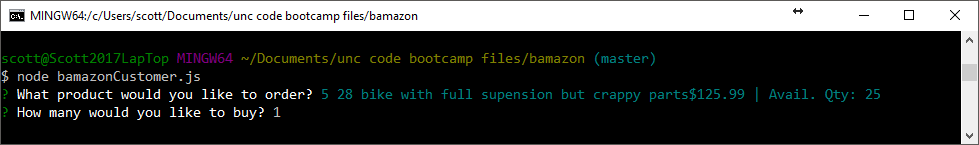

# BAMAZON! #

Bamazon is primitive start of an inventory / ecommerce system.  This is stage one.  There is no traditional front end HTML that you would normally think of when ordering a product. This is early testing of concept and logic.  This uses NodeJS and MySQL. It also uses "inquirer" & "mysql" depencentcies. Details can be found in the package.json. The MySQL database populated with 10 test items.  The items have an ID, Name, Price and a Quanitity.  NodeJS Server should be run locally and accessed via a CLI (Command Line Intervface - Like Bash).

**See Screen Grabs Below for a Visual of the outline below**

1. Get started by using CLI and running bamazonCustomer.js in NodeJS. Once Started, it lists the products.  
2. It will ask you to pick a product via the arrow keys, hit enter to select.
3. Then indicate the quanitity that you desire, Hit enter to commit choice.  
4. Once that information is submitted to the DataBase the quanitity of the order is compared to the inventory in stock.  
	* If their is sufficient inventory, the user gets a message that the order is accepted and the inventory is decreased by the amount ordered.  
	* If there is insufficient inventory, the order is reject, the user is notified that the order didn't go thru. 
5. Then the procress then starts all over again.  

That is all the functionality at this point.  It is basically testing getting info from the DB, running some server side logic and then responding back to the user.  

Step 1 Running bamazonCustomer.js in Bash CLI

Step 2 Pick the product with arrow keys

Step 3 Input desired quanitity.

Step 4A - Sufficient Inventory - Order Successful.

Step 4B - Insufficient Inventory - Order Denied.

Step 5 - Process Starts Again - Note inventory decreases if previous order was accepted.
